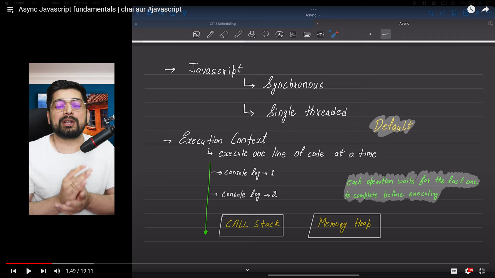
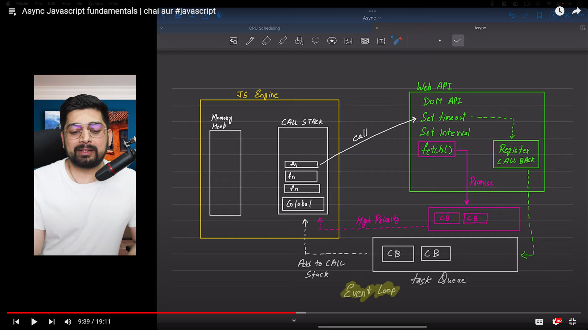

JavaScript : 
```javascipt
1. Synchronous 
2. Single Threaded
```
``` Javascript 
Blocking Code : 
- Block the flow of the program
- read file Sync 

```

```javascript
Non- Blocking Code :
- Does not block execution
- Read file async

```




